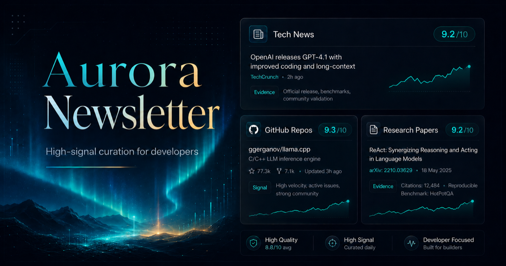
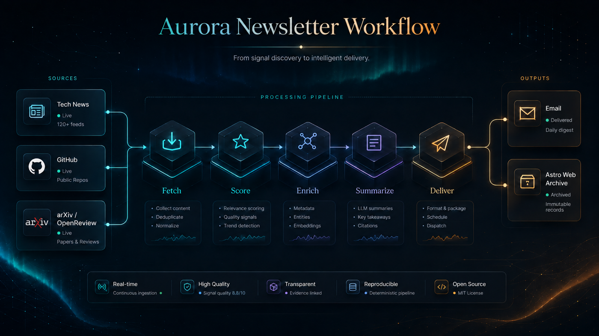
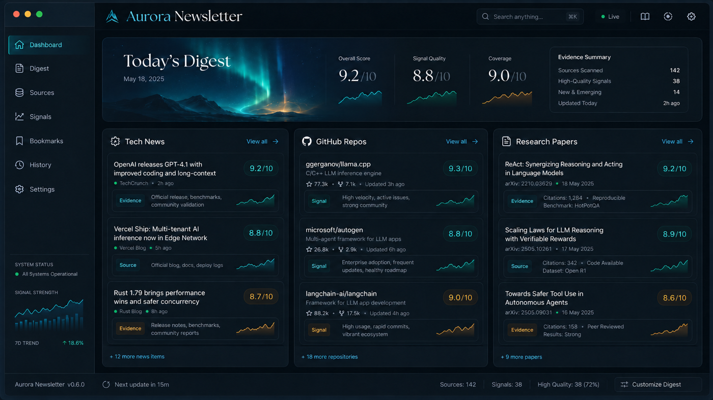

<div align="center">


# Aurora Digest

**A self-hosted, high-signal daily learning radar for AI builders, researchers, and students.**

Aurora turns timely tech news, GitHub repositories, and research papers into a
clean daily digest for email and GitHub Pages, so builders can spend less time
scanning feeds and more time learning what is worth acting on.

[](#)
[](pyproject.toml)
[](https://github.com/astral-sh/uv)
[](.github/workflows/aurora-digest.yml)
[](https://kenny2077.github.io/Aurora-Digest/)
[](LICENSE)

<br>



</div>

## Why Aurora

Aurora is a daily learning radar for AI builders, researchers, and students.
It is built for the daily question that broad feeds do not answer well: what is
worth reading, studying, and experimenting with today?

Aurora focuses on a small, high-signal set of useful items:

| Signal | What Aurora looks for | What the digest gives you |
| --- | --- | --- |
| Tech News | Timely AI and technology stories with strong source signals | Linked headline, source, and concise summary |
| GitHub Repos | Projects with real activity, adoption, and learning value | Repo link, stats, quality label, topic/language chips, and value |
| Research Papers | Papers selected by research fields and enrichment signals | Paper link, venue/status, summary, and what to learn |

The default unified digest stays intentionally compact: 5 tech news items, 3
GitHub repositories, and 3 research papers. Aurora favors a high-signal daily
brief over complete coverage.

## Today's Learning Workflow

The unified digest is designed around a compact daily loop:

- Pick one paper to understand.
- Pick one repo to study.
- Scan timely AI news with high engagement.
- Use the value notes to decide what deserves deeper follow-up.

Aurora tracks:

- `tech_news`: timely, high-engagement technology news.
- `scholar`: research papers by selected research fields.
- `repo_learning`: GitHub repositories by selected learning interests.
- `unified_digest`: one combined digest across news, repos, and papers.

## How It Works

<p align="center">
  
</p>

Aurora keeps one shared pipeline shape across modes:

```text
fetch -> normalize -> deduplicate -> score -> enrich -> summarize -> render -> deliver
```

Each source adapter normalizes into a shared item model, then mode-specific
scoring and enrichment decide which items are worth showing. The visible unified
digest is ordered as:

1. Tech News
2. GitHub Repos
3. Research Papers

Diagnostics stay in CLI output, GitHub Actions logs, and `run_summary.json`;
the email and Pages output stay focused on the digest itself.

## Product Surface

<p align="center">
  
</p>

Aurora publishes the same product-quality digest through practical self-hosted
channels:

- Email delivery through SMTP when recipients are configured.
- GitHub Pages publishing from the generated Astro site.
- Local Markdown and HTML reports for debugging and review.
- JSONL snapshots plus `run_summary.json` for source failures, rate limits, and
  delivery diagnostics.

The screenshot shows the intended digest surface. Aurora is not a hosted SaaS
dashboard; it is a repository you run locally or on GitHub Actions.

## 10-Minute Setup

Local setup:

```bash
rtk uv sync --dev
npm --prefix web ci
rtk uv run aurora config validate --config data/config.example.json
rtk uv run aurora doctor --config data/config.example.json
```

Run a no-network smoke test:

```bash
rtk uv run aurora run --dry-run --mode all --output-dir /tmp/aurora-dry-run
```

Run the unified daily digest locally:

```bash
rtk uv run aurora run --mode unified_digest --config data/config.example.json
```

Run a topic-focused digest using the GitHub Actions config:

```bash
rtk uv run aurora run --mode unified_digest --config data/actions.config.json --topic agents
```

GitHub Actions setup:

1. Fork or clone the repository.
2. Configure GitHub Pages to publish from the `gh-pages` branch.
3. Add only the secrets for channels you enable.
4. Run the `aurora-digest` workflow manually once before relying on the schedule.

## Repository Recommendations

Agents-focused repositories:

```bash
rtk uv run aurora run --mode repo_learning --repo-interest agents
```

Computer-vision repositories:

```bash
rtk uv run aurora run --mode repo_learning --repo-interest cv
```

MCP ecosystem repositories:

```bash
rtk uv run aurora run --mode repo_learning --repo-interest mcp
```

Aurora uses `GH_SEARCH_TOKEN` first, then `GITHUB_TOKEN`, and can run
unauthenticated with lower GitHub rate limits.

## Scholar Radar

Machine-learning research:

```bash
rtk uv run aurora run --mode scholar --research-field ml
```

ML plus agents:

```bash
rtk uv run aurora run --mode scholar --research-field ml --research-field agents
```

## Topic Presets

For the unified digest, `--topic` applies one preset to tech news keywords,
repository interests, and research fields:

| Topic | Tech news focus | Repo interests | Scholar fields |
| --- | --- | --- | --- |
| `llm` | models, inference, RAG, evaluation | `llm`, `mcp`, `devtools` | `llm` |
| `agents` | agents, tool use, MCP, workflows | `agents`, `mcp`, `workflow-automation` | `agents` |
| `robots` | robotics, embodied AI, robot learning | `robots` | `robots` |

Use topic presets when you want the daily digest to stay coherent across news,
hands-on repositories, and papers. You can select a topic in GitHub Actions, set
`run.topic` in config, or pass `--topic` locally. See
[docs/interests.md](docs/interests.md) for the full interest and research field
preset list.

## Quality Tiers

Aurora defaults to `balanced`: a modest number of DeepSeek-compatible calls for
polish and ranking, bounded source enrichment, and deterministic fallbacks when
providers are slow or unavailable.

| Tier | Use when | Behavior |
| --- | --- | --- |
| `lean` | You want the cheapest reliable daily feed | deterministic-first, smaller source enrichment, no child-mode LLM ranking |
| `balanced` | You want the default public digest | a few LLM calls per section, moderate repo and paper enrichment |
| `thorough` | You want a deeper editorial pass | more LLM ranking/polish calls and broader repo/paper enrichment |

Use `--quality-tier balanced`, set `run.quality_tier`, or choose the tier in
GitHub Actions.

## Secrets

Required only when email delivery is enabled:

- `SMTP_USERNAME, EMAIL_PASSWORD, AURORA_EMAIL_RECIPIENTS`

Optional:

- `DEEPSEEK_API_KEY` for LLM summaries and ranking.
- `GH_SEARCH_TOKEN` for higher GitHub Search API limits.
- `GITHUB_TOKEN fallback` is used automatically in GitHub Actions.
- `SEMANTIC_SCHOLAR_API_KEY` for optional scholar enrichment configuration.

## Local LLMs

Aurora supports local best-effort enrichment through Ollama, LM Studio, other
OpenAI-compatible endpoints, and AnythingLLM workspaces. Local LLMs affect
scoring, summaries, tags, and unified-digest public-copy repair only; source
fetching, deduplication, delivery, and source-health logic remain deterministic.

Start with the Ollama example, then set `ai.model` to any model installed in
your local Ollama instance. The Qwen model is an example, not a restriction.

```bash
rtk uv run aurora config validate --config data/local-llm.config.example.json
rtk uv run aurora doctor --config data/local-llm.config.example.json --local-llm
rtk uv run aurora run --mode unified_digest --config data/local-llm.config.example.json --local-llm
```

`ai.task_models` can override the configured default model for `ranking`,
`summary`, or `repair`. The `summary` task refines the optional opening sentence
of a unified digest; ranking and repair retain their existing behavior.
`--free-mode` and `--local-llm` require a local provider and prevent Aurora
from calling DeepSeek or OpenAI. `--skip-llm` remains fully deterministic.

For LM Studio or another compatible server, use `provider: "lmstudio"` or
`provider: "openai_compatible"` with its `base_url`. LM Studio defaults to
`http://127.0.0.1:1234/v1`; an `openai_compatible` provider requires an
explicit URL.

For AnythingLLM, configure `provider: "anythingllm"`, `base_url`,
`workspace_slug`, and an API-key environment variable such as
`ANYTHINGLLM_API_KEY`. Aurora uses the workspace chat API and expects its
response text to satisfy Aurora's JSON contract. Confirm the endpoint shape
against the local instance's `/api/docs` before enabling it. `doctor --local-llm`
checks reachability, configured model/workspace access, authentication, and a
short JSON response by default.

## Delivery

By default Aurora writes Markdown/HTML reports to `reports/` and Astro content
posts to `web/src/content/posts/`. GitHub Actions builds the Astro site into
`web/dist/` for Pages publishing.

Use deterministic-only mode:

```bash
rtk uv run aurora run --mode unified_digest --skip-llm
```

Preview without delivery:

```bash
rtk uv run aurora run --mode unified_digest --skip-delivery
```

Build the Aurora Digest web frontend:

```bash
npm --prefix web run build
```

Run the web frontend locally:

```bash
npm --prefix web run dev -- --host 127.0.0.1 --port 4321
```

## GitHub Pages Setup

Aurora publishes an Astro static site to the `gh-pages` branch. In GitHub
repository settings, configure Pages to deploy from `gh-pages` at the branch
root. The workflow restores prior generated digest content from
`.aurora/content/posts`, writes the latest digest into `web/src/content/posts/`,
builds `web/dist/`, then pushes that generated site to `gh-pages`.

The web UI is built from the AstroPaper-based app in `web/`. The homepage
features the latest digest as "Today's Digest" and groups earlier generated
posts by month. Individual digest pages keep repo cards compact with stats,
quality labels, topic/language chips, and a single Value section.

Useful local checks:

```bash
rtk uv run aurora doctor --config data/actions.config.json
rtk uv run aurora run --dry-run --mode all --output-dir /tmp/aurora-actions-smoke
npm --prefix web run build
```

Every run writes JSONL snapshots and a `run_summary.json` file under
`data/runs/<run_id>/<mode>/`. Use that file first when debugging missing
content, source failures, rate limits, or delivery issues.

## Cost And Source Guardrails

`ai.max_requests_per_run` and `ai.max_tokens_per_run` cap optional LLM analysis
for a whole run. When the budget is exhausted, Aurora keeps the digest running
with deterministic scoring and records AI usage counters in `run_summary.json`.
Use `--skip-llm` when you want a fully deterministic run.
`run_summary.json` records the provider/model, request and fallback counts,
latency, JSON failures, and zero cloud cost for local providers. Cloud cost is
reported when both `ai.input_cost_per_million_tokens` and
`ai.output_cost_per_million_tokens` are configured; Aurora does not embed
volatile provider pricing.

Tech news source packs are opt-in. In addition to Hacker News and explicit RSS
feeds, config can enable curated RSS groups, Reddit listings, and GitHub
releases. The scheduled public config leaves Reddit disabled because the public
JSON endpoint frequently blocks automated fetches. Source health history is
tracked in the cache and weak source health demotes candidates internally
without adding diagnostics to the public digest.

## Quality Evaluation

Aurora can replay saved `SignalItem` JSONL fixtures through unified digest
selection and rendering without hitting live sources. Use this before changing
ranking or digest presentation logic.

```bash
rtk uv run aurora eval replay --fixture tests/fixtures/digest_quality/agents.jsonl --output /tmp/aurora-agents-eval.json
```

Compare two replay reports to see selected item churn, count changes, missing
sections, source mix differences, and internal selection diagnostics:

```bash
rtk uv run aurora eval compare --before /tmp/aurora-before.json --after /tmp/aurora-after.json
```

Generate a fixture-only LLM benchmark report without contacting a provider:

```bash
rtk uv run aurora eval llm --fixture tests/fixtures/digest_quality/agents.jsonl --output /tmp/aurora-llm-eval.json
```

Add one or more candidate config files and `--live` to run them. Without
`--live`, candidates are recorded as `not_run` and no provider is contacted.
The live report includes selection overlap, JSON validity, summary/public-copy
failures, latency, request and fallback counts, and any available cloud-cost
estimate.

## Troubleshooting Empty Sections

- Empty research papers usually means arXiv/OpenReview returned no qualifying
  papers or rate-limited; check `scholar_source_failures` and the scholar cache
  note in the unified digest.
- Empty repo learning usually means GitHub Search rate limits, strict star/date
  filters, or repeated recommendations suppressed by state.
- Empty tech news usually means Hacker News/RSS candidates did not meet score,
  recency, or keyword filters.
- Empty Pages output should fail the workflow instead of publishing a placeholder.
  Inspect `run_summary.json`, workflow logs, and `web/src/content/posts/`.

## What Aurora Is Not

Aurora is not a realtime alerting system, an exhaustive literature review, a
SaaS dashboard, or a GitHub Trending clone. It is a self-hosted daily learning
radar that favors a small set of useful items over complete coverage.

## Project Governance

- [Code of Conduct](CODE_OF_CONDUCT.md) defines community standards.
- [Contributing](CONTRIBUTING.md) covers setup, tests, code style, and pull
  request expectations.
- [Security](SECURITY.md) explains supported versions, security properties, and
  vulnerability reporting.

## License

Aurora is released under the [MIT License](LICENSE). See [NOTICE](NOTICE) for
upstream Horizon-family attribution.
